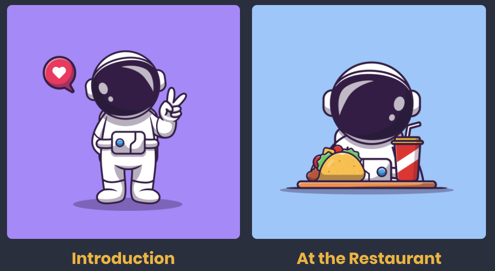
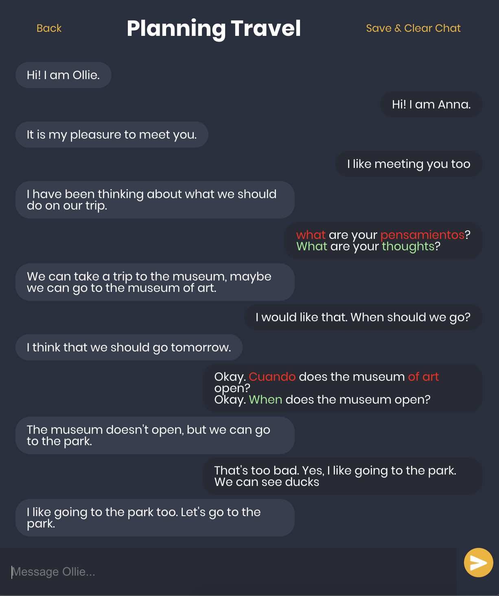
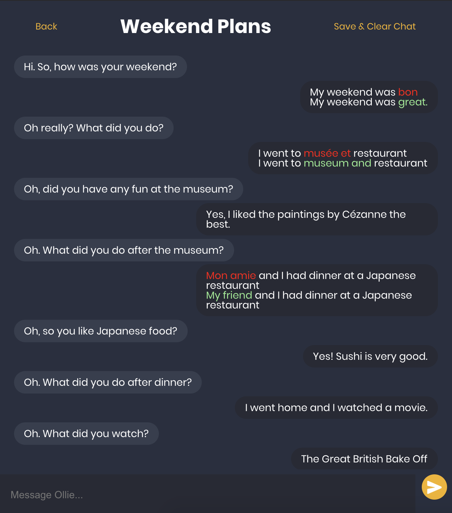

A chatbot that helps you learn languages! It will engage in simple conversations with you to practice scenarios from daily life, like introductions, planning trips, and ordering food at the restaurant.

Chatbot currently speaks in English and can converse with users whose native languages are Spanish, French, and German. It will correct your grammar and convert any words you type in your native language to English. The next time you're racking your brain for what the English word or phrase is, you can just type in your native language rather than pull up a translation app.

 
 

Live working demo link: https://languagebot-70193.web.app/
